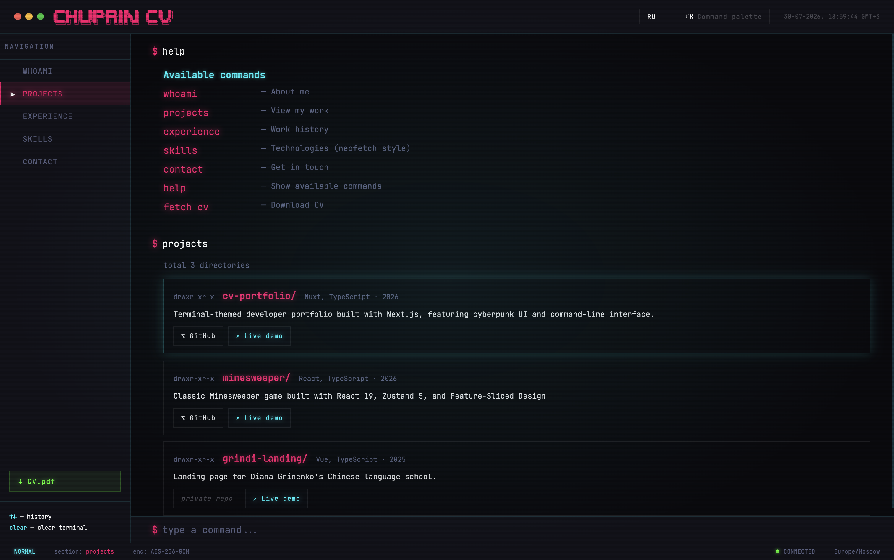

<h1 align="center">Cyberpunk CV</h1>

<p align="center">
  Терминальное портфолио-резюме на Next.js 16, React 19 и Feature-Sliced Design
</p>

<p align="center">
  <a href="https://mchuprin.github.io/chuprin-cv/">Live Demo</a> ·
  <a href="#-запуск">Запуск</a> ·
  <a href="#-подход-и-решения">Архитектура</a>
</p>

<p align="center">
  
</p>

<p align="center">
  
  
  
  
  
  
  
  
  
  
</p>

<p align="center">
  <a href="README.md">🇬🇧 English version</a>
</p>

---

## Задача

Создать портфолио фронтенд-разработчика, которое выглядит и ощущается как настоящий терминал — с вводом команд, эффектами сканлайнов, свечением и эстетикой киберпанка. Сайт должен быть полностью статичным, двуязычным (RU/EN) и построенным по архитектуре Feature-Sliced Design.

## Технологии

| Слой | Технология |
|------|------------|
| Фреймворк | Next.js 16 (App Router, статический экспорт) |
| Язык | TypeScript 5 |
| UI-библиотека | React 19 |
| Стили | Sass (SCSS Modules) |
| Управление состоянием | React Context |
| Интернационализация | next-intl (RU/EN) |
| Архитектура | Feature-Sliced Design |
| Линтеры | ESLint, Prettier, Steiger (FSD linter) |
| Деплой | GitHub Actions → GitHub Pages |

## Структура проекта

```
src/
├── _app/                  # Слой приложения: провайдеры, лейауты, глобальные стили
│   ├── layouts/           # Основной лейаут страницы
│   ├── providers/         # Контекст-провайдеры (i18n)
│   ├── router/            # Конфигурация роутера
│   └── styles/            # Глобальные SCSS-стили
├── _pages/                # Слой страниц: компоненты маршрутов
│   └── main/              # Главная (и единственная) страница
├── widgets/               # UI-блоки, формирующие страницу
│   ├── command-palette/   # Палитра команд (Ctrl+K)
│   ├── footer/            # Подвал терминала
│   ├── header/            # Заголовок терминала (title bar)
│   ├── horizontal-tabs/   # Навигация табами (планшеты)
│   ├── sidebar/           # Сайдбар с навигацией и скачиванием CV
│   └── terminal-input/    # Поле ввода команд терминала
├── entities/              # Бизнес-сущности
│   ├── whoami/            # Карточка разработчика
│   ├── skills/            # Навыки в стиле neofetch
│   ├── projects/          # Список проектов
│   ├── experience/        # Таймлайн опыта работы
│   ├── help/              # Вывод команды help
│   ├── contact/           # Контактная информация
│   ├── cv/                # Данные резюме и скачивание PDF
│   └── unknown-command/   # Fallback для неизвестных команд
├── features/              # Фичи пользовательского взаимодействия
│   └── locale-switcher/   # Переключатель языка (RU ↔ EN)
└── shared/                # Переиспользуемые: компоненты, хуки, конфиги, типы
    ├── api/               # API-слой (сейчас не используется)
    ├── config/            # Конфиг i18n (request, routing, messages)
    ├── lib/               # Утилиты: classNames, контексты, хуки
    ├── model/             # Общие типы и константы
    └── ui/                # UI-кит: button, card, input, navlink, overlay, terminal-section

.github/
├── assets/
│   └── demo.png           # Скриншот для README
└── workflows/
    └── deploy.yml          # Деплой на GitHub Pages

public/
├── cv/                    # PDF-резюме (RU + EN)
├── me.jpeg                # Фото автора
└── ...                    # Favicon, иконки, SVG

app/                       # Корень App Router (Next.js)
├── [locale]/              # Маршруты с учётом локали
├── layout.tsx             # Корневой HTML-layout
├── page.tsx               # Корневой редирект → /[locale]
└── globals.css            # CSS-сброс и глобальные стили
```

## Подход и решения

### Feature-Sliced Design

Весь код живёт в своём FSD-слое со строгими правилами импорта. Сущности экспортируют только публичный API через `index.ts`. Это делает кодовую базу поддерживаемой и предотвращает циклические зависимости.

**Слои:** `_app` → `_pages` → `widgets` → `entities` → `features` → `shared`

### Терминальный UI

Интерфейс имитирует эмулятор терминала — наложение сканлайнов, светящийся текст, моноширинный шрифт, кастомный курсор и навигация через команды. На десктопе — полноценный терминальный лейаут; на планшетах — горизонтальные табы; на мобилке — нижняя навигация.

### Статический экспорт с i18n

`next-intl` обеспечивает полную локализацию на русский и английский. Приложение статически экспортируется (`output: 'export'`) и деплоится на GitHub Pages — нулевой серверный рантайм. PDF-резюме адаптированы под локаль и скачиваются из `public/cv/`.

### Адаптивный дизайн

Три брейкпоинта:
- **Десктоп** (>1024px): полноценный терминальный лейаут с сайдбаром
- **Планшет** (768–1024px): горизонтальные табы вместо сайдбара
- **Мобилка** (<768px): нижняя панель навигации, упрощённый лейаут

## Команды терминала

| Команда | Описание |
|---------|----------|
| `whoami` | Карточка разработчика |
| `skills` | Навыки в стиле neofetch |
| `projects` | Список проектов |
| `experience` | Таймлайн опыта работы |
| `contact` | Контактная информация |
| `cv` | Скачать резюме в PDF |
| `help` | Список доступных команд |
| `clear` | Сброс терминала в начальное состояние |
| `sudo hire-me` | Пасхалка → контактная информация |

## Возможности

- **Терминальный UI** — киберпанк-интерфейс со сканлайнами, свечением и кастомным курсором
- **i18n** — полная локализация на русский/английский через `next-intl`
- **Скачивание резюме** — кнопка в сайдбаре (с учётом локали: RU/EN)
- **Статический экспорт** — полностью статичный сайт на GitHub Pages
- **FSD-архитектура** — строгое разделение слоёв для масштабируемого кода
- **Адаптивный дизайн** — десктоп (терминал), планшет (табы), мобилка (нижняя навигация)
- **Палитра команд** — быстрый доступ к командам через `Ctrl+K`
- **Анимации переходов** — плавные анимации между секциями

## Ограничения

- **PWA** — ещё не реализовано
- **Семантический HTML** — возможное улучшение в будущем
- **Мета-теги** — Open Graph / превью для соцсетей не настроены
- **Пиксельное фото** — запланировано для секции `whoami`
- **Баг скачивания CV** — скачивание резюме через Command Palette может не работать

## Запуск

### Требования

- Node.js 22+
- pnpm 9+

### Разработка

```bash
git clone git@github.com:mchuprin/chuprin-cv.git
cd chuprin-cv
pnpm install
pnpm dev
```

Откройте [http://localhost:3000](http://localhost:3000) в браузере.

### Сборка

```bash
pnpm build
# Выход → out/
```

### Линтеры

```bash
pnpm lint        # ESLint
pnpm lint:fsd    # Feature-Sliced Design linter (Steiger)
```

### PDF-резюме

Разместите PDF-файлы резюме в `public/cv/`:
- `public/cv/Максим_Чуприн_CV.pdf` — русская версия
- `public/cv/Maksim_Chuprin_CV.pdf` — английская версия

## Деплой

Проект автоматически деплоится на GitHub Pages при каждом пуше в `main`.

**Процесс:**
1. Пуш в `main`
2. GitHub Actions устанавливает зависимости через pnpm
3. Собирает статический экспорт (`next build` с `output: 'export'`)
4. Деплоит папку `out/` на GitHub Pages

Base path: `/chuprin-cv`

## Автор

**Максим Чуприн** — Frontend Developer (6+ лет)

- Telegram: [@maks_chuprin](https://t.me/maks_chuprin)
- Email: chuprin.web.dev@gmail.com
- GitHub: [mchuprin](https://github.com/mchuprin)
